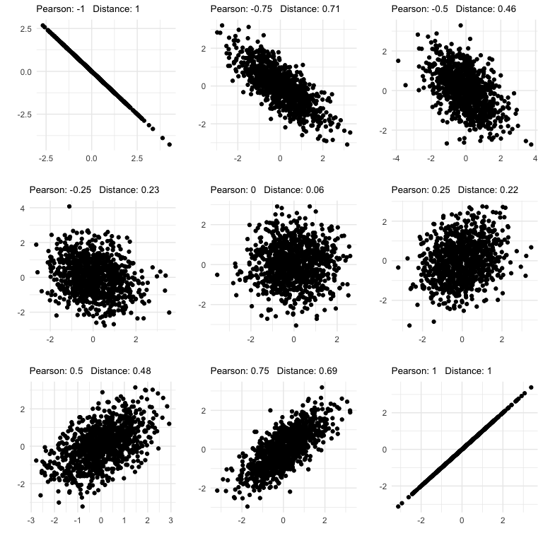
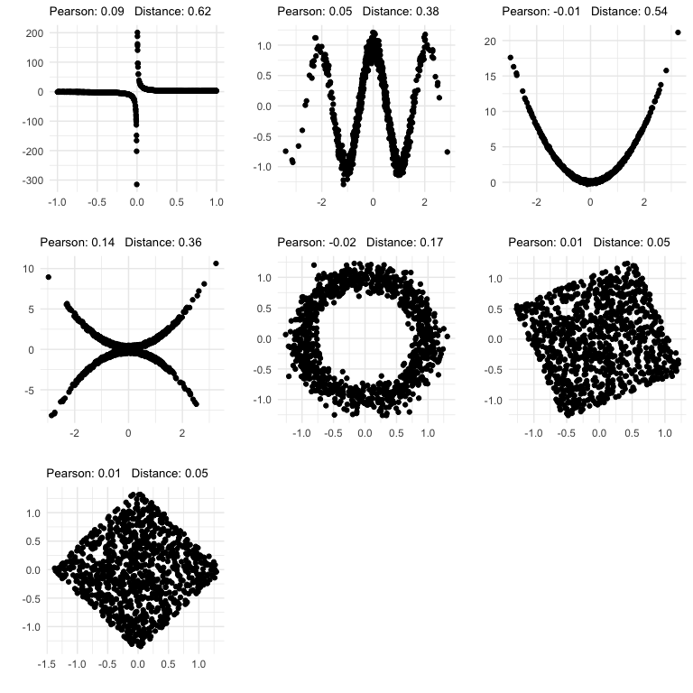

Pearson Correlation vs Distance Correlation
================

Show the difference between Pearson Correlation and Distance Correlation
========================================================================

Linear relationships
--------------------

``` r
# simulate some data with a range of pearson correlation coefficients
out <- tibble(pearson = numeric(),
              dcor = numeric(),
              pval = numeric(),
              x = numeric(),
              y = numeric())

for(i in seq(-1, 1, by = .25)){
  sd = matrix(c(1, i, i, 1), ncol = 2)
  x = rmvnorm(1000, c(0, 0), sd)
  tmp <- data.frame(x)
  test <- dcor.test(tmp$X1, tmp$X2, R = 100)
  out <- bind_rows(out,
                   tibble(pearson = i,
                          dcor = test$statistic,
                          pval = test$p.value,
                          x = tmp$X1,
                          y = tmp$X2))
  
  
}


# panel of plots
p <- list()
j <- 1
for(i in unique(out$pearson)){
  tmp <- filter(out, pearson == i)
  ptitle <- paste0("Pearson: ", i, "   Distance: ", round(unique(tmp$dcor), 2))
  p[[j]] <- ggplot(tmp) + geom_point(aes(x, y)) + 
    labs(x = "", y = "", title = ptitle) + 
    theme_minimal() +
    theme(plot.title = element_text(size = 10))
  j <- j+1
}

print(do.call(gridExtra::grid.arrange, p))
```



    ## TableGrob (3 x 3) "arrange": 9 grobs
    ##   z     cells    name           grob
    ## 1 1 (1-1,1-1) arrange gtable[layout]
    ## 2 2 (1-1,2-2) arrange gtable[layout]
    ## 3 3 (1-1,3-3) arrange gtable[layout]
    ## 4 4 (2-2,1-1) arrange gtable[layout]
    ## 5 5 (2-2,2-2) arrange gtable[layout]
    ## 6 6 (2-2,3-3) arrange gtable[layout]
    ## 7 7 (3-3,1-1) arrange gtable[layout]
    ## 8 8 (3-3,2-2) arrange gtable[layout]
    ## 9 9 (3-3,3-3) arrange gtable[layout]

Nonlinear Relationships
-----------------------

``` r
# function to rotate the matrix
rotation <- function(t, X) return(X %*% matrix(c(cos(t), sin(t), -sin(t), cos(t)), ncol = 2))

# simulate various nonlinear relationships
n <- 1000
x <- runif(n, -1, 1)
y <- 1/x + x^2 + x^3 + rnorm(n, 0, .1)

test1 <- cor(x, y)
test2 <- dcor.test(x, y, R = 100)

out <- tibble(id = 1,
              x = x,
              y = y,
              pearson = test1,
              dcor = test2$statistic)


# cosine
x <- rnorm(n)
y <- cos(x*3) + rnorm(n, 0, .1)
test1 <- cor(x, y)
test2 <- dcor.test(x, y, R = 100)

out <- rbind(out,
             tibble(id = 2,
                    x = x,
                    y = y,
                    pearson = test1,
                    dcor = test2$statistic))


# parabolic
x <- rnorm(n)
y <- 2*x^2 + rnorm(n, 0, .1)
test1 <- cor(x, y)
test2 <- dcor.test(x, y, R = 100)

out <- rbind(out,
             tibble(id = 3,
                    x = x,
                    y = y,
                    pearson = test1,
                    dcor = test2$statistic))


# double para
y <- (x^2 + runif(n, 0, 1/2)) * sample(c(-1,1), n, replace = TRUE)
test1 <- cor(x, y)
test2 <- dcor.test(x, y, R = 100)

out <- rbind(out,
             tibble(id = 4,
                    x = x,
                    y = y,
                    pearson = test1,
                    dcor = test2$statistic))


# circle
x <- rnorm(n)
y = cos(x*pi) + rnorm(n, 0, 1/8)
x = sin(x*pi) + rnorm(n, 0, 1/8)
test1 <- cor(x, y)
test2 <- dcor.test(x, y, R = 100)

out <- rbind(out,
             tibble(id = 5,
                    x = x,
                    y = y,
                    pearson = test1,
                    dcor = test2$statistic))


# parallelogram
x = runif(n, -1, 1)
y <- runif(n, -1, 1)
xy = rotation(-pi/8, cbind(x,y))
tmp <- data.frame(xy)
names(tmp) <- c("x", "y")
test1 <- cor(x, y)
test2 <- dcor.test(x, y, R = 100)

out <- rbind(out,
             tibble(id = 6,
                    x = tmp$x,
                    y = tmp$y,
                    pearson = test1,
                    dcor = test2$statistic))


# diamond
xy = rotation(-pi/8, xy)
tmp <- data.frame(xy)
names(tmp) <- c("x", "y")
test1 <- cor(x, y)
test2 <- dcor.test(x, y, R = 100)

out <- rbind(out,
             tibble(id = 7,
                    x = tmp$x,
                    y = tmp$y,
                    pearson = test1,
                    dcor = test2$statistic))


# panel of plots
p <- list()
j <- 1
for(i in 1:7){
  tmp <- filter(out, id == i)
  ptitle <- paste0("Pearson: ", round(unique(tmp$pearson), 2), "   Distance: ", round(unique(tmp$dcor), 2))
  p[[j]] <- ggplot(tmp) + geom_point(aes(x, y)) + 
    labs(x = "", y = "", title = ptitle) + 
    theme_minimal() +
    theme(plot.title = element_text(size = 10))
  j <- j+1
}

print(do.call(gridExtra::grid.arrange, p))
```



    ## TableGrob (3 x 3) "arrange": 7 grobs
    ##   z     cells    name           grob
    ## 1 1 (1-1,1-1) arrange gtable[layout]
    ## 2 2 (1-1,2-2) arrange gtable[layout]
    ## 3 3 (1-1,3-3) arrange gtable[layout]
    ## 4 4 (2-2,1-1) arrange gtable[layout]
    ## 5 5 (2-2,2-2) arrange gtable[layout]
    ## 6 6 (2-2,3-3) arrange gtable[layout]
    ## 7 7 (3-3,1-1) arrange gtable[layout]
